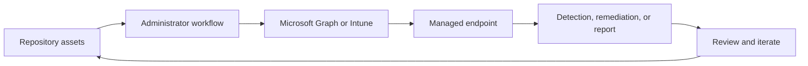

<!-- unified-readme:start -->
<div align="center">

# Intune DevOps

**DevOps pipeline integration for Microsoft Intune configuration management and deployment automation.**

Build. Release. Govern.

[](https://github.com/JayRHa/IntuneDevOps/stargazers)
[](https://github.com/JayRHa/IntuneDevOps/network/members)
[](https://github.com/JayRHa/IntuneDevOps/issues)
[](https://github.com/JayRHa/IntuneDevOps/graphs/contributors)

[Check out my blog](https://jannikreinhard.com)
<p>
  <a href="https://jannikreinhard.com/">Blog</a> ·
  <a href="https://www.linkedin.com/in/jannik-r/">LinkedIn</a> ·
  <a href="https://x.com/jannik_reinhard">X</a>
</p>

---

`Endpoint Management` | `PowerShell` | `Public` | `Maintained`

</div>

## What is this?

Intune DevOps supports Microsoft Intune and endpoint management workflows such as automation, troubleshooting, remediation, deployment, or reporting.

## Project Context

- Use it when Intune work should be scripted, packaged, synchronized, or made easier to repeat.
- Most workflows start from repository assets, then move through Microsoft Graph, Intune, or device-side execution.
- This repository is maintained as a practical project and reference asset.

## How It Works

The repository stores scripts or tooling, administrators configure or run them, Intune and Microsoft Graph apply the work, and endpoint results feed back into reports or follow-up actions.



## Quick Start

1. Review the project context and workflow below.
2. Clone the repository:

   ```bash
   git clone https://github.com/JayRHa/IntuneDevOps.git
   ```

3. Continue with the setup, usage, or workflow sections below.

---
<!-- unified-readme:end -->

## Change Log
---
- Version 0.1:
   - Support for Config Profiles, Compliance Policies, Filter, Remediation and Powershell scripts 

## Description


## How does it work
You can find all informations how to setup and how does it work in my blog post:
https://jannikreinhard.com/
